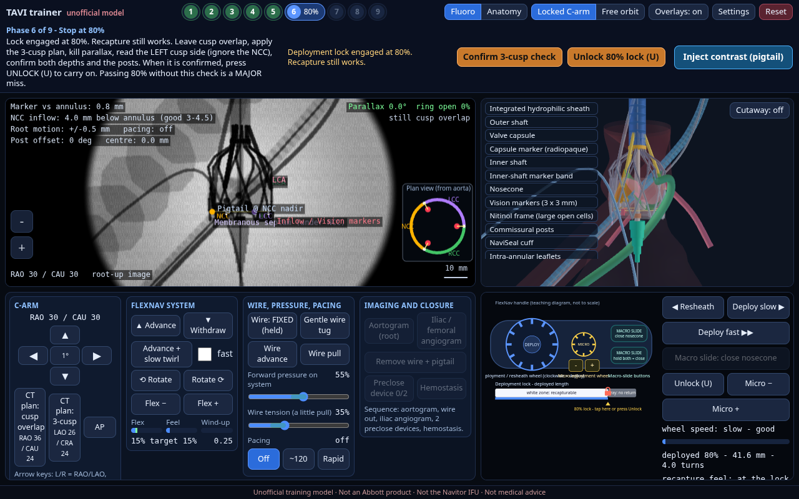

> **Unofficial training model only.** Not an Abbott product, not the Navitor IFU, and not medical advice. No Abbott logos or certification are implied. Physics values are uncalibrated teaching estimates.

Quick start: open `index.html` in a browser (single file, works offline). Rebuild with `npm i && npm run build`.

# Navitor Vision / FlexNav TAVI teaching simulator (UNOFFICIAL)
Unofficial training model. Not an Abbott product, not the Navitor IFU, not medical advice.

* Play: open `index.html` (single self-contained file, no network).
* Build: `npm i && node build.mjs` (esbuild bundles src/ + three.js into index.html).
* Tests: `node tests/logic.mjs` (pure logic, all gates and failure paths), `node tests/e2e.mjs desktop|phone` (Playwright + screenshots into shots/final).
* Debug hook: `window.__sim` (state, setAngles, act.*, hold, step, ...).

## Physics model: teaching estimates, uncalibrated

Deployment and seating live in `src/physics.js` (pure, deterministic, unit-tested in `tests/physics.mjs`). **No manufacturer data was used.** Every constant is an *estimate (uncalibrated)* chosen only so the qualitative behaviour feels right; none of them are real device values.

- Wheel = capsule retraction in mm (turns-per-mm mapping; 100% = full retraction). Progressive, inflow-first frame expansion with foreshortening (the frame shortens as it opens), radial force/grip from the 27 mm-in-24 mm oversize, and hysteresis between deployment and resheath.
- Seating: NCC-side and left-cusp-side inflow depth are computed separately (tilt, root motion, forward pressure, wire tension, wire stiffness) with stick-slip friction against the native leaflets/calcium (the frame can hang up, then jump), a membranous-septum soft stop, pacing-dependent root motion/ejection drag, migration when the wheel is too fast (direction = sign of the net force), spring-back pop past the point of no return and at release.
- Recapture: resistance rises toward the 80% lock (feel gauge in the handle diagram); no recapture past the lock.
- Depth semantics unchanged: 3 to 4.5 mm below the annulus is good.

| constant | value | unit | meaning | status |
|---|---|---|---|---|
| capsuleTravelMm | 52 | mm | capsule retraction needed to fully unsheathe (100% on the wheel) | estimate (uncalibrated) |
| wheelTurnsFull | 5 | turns | wheel turns for full retraction -> turns per mm = wheelTurnsFull / capsuleTravelMm | estimate (uncalibrated) |
| lockFraction | 0.8 | - | 80% stop: lock engages here; recapture is only possible below it | estimate (uncalibrated) |
| safeSpeedMmS | 4.4 | mm/s | capsule retraction speed below 80% that stays controlled (about 0.085 of travel per s) | estimate (uncalibrated) |
| safeSpeedPost80MmS | 3.9 | mm/s | same, after the lock (outflow ring releasing: about 0.075 of travel per s) | estimate (uncalibrated) |
| frameCrimpLenMm | 46 | mm | axial length of the frame crimped in the capsule (longer than expanded) | estimate (uncalibrated) |
| frameFreeLenMm | 40 | mm | axial length of the fully expanded frame (foreshortened) | estimate (uncalibrated) |
| releaseRampMm | 6 | mm | capsule travel over which one frame section goes from crimped to open (progressive) | estimate (uncalibrated) |
| frameFreeRadiusMm | 13.5 | mm | free (unconstrained) inflow radius of the 27 mm valve | estimate (uncalibrated) |
| frameCrimpRadiusMm | 3.3 | mm | crimped radius | estimate (uncalibrated) |
| annulusRadiusMm | 12 | mm | native annulus radius (24 mm case annulus) | estimate (uncalibrated) |
| annulusCompliance | 0.25 | - | fraction of oversize the annulus yields to (calcified annulus: stiff) | estimate (uncalibrated) |
| hysteresisMm | 4 | mm | play of the frame: on resheath it stays open until the capsule has travelled this far back | estimate (uncalibrated) |
| radialForceN_perMm | 6 | N/mm | radial force per mm of oversize at full expansion | estimate (uncalibrated) |
| gripForceScaleN | 8 | N | radial force at which the frame grips ~63% (grip = 1-exp(-F/scale)) | estimate (uncalibrated) |
| seatDropMm | 4.1 | mm | depth the inflow edge settles to below the annulus once the frame wedges in the root | estimate (uncalibrated) |
| foreshortCouplingMm | 0.35 | - | fraction of the frame shortening that pulls an UN-gripped inflow edge up toward the aorta | estimate (uncalibrated) |
| kPressMm | 1.8 | mm per unit | depth shift per unit of system forward pressure above/below neutral (0.5) | estimate (uncalibrated) |
| kWireMm | 1.5 | mm per unit | depth shift per unit of wire tension above/below neutral (0.3), at wire stiffness 1.0 | estimate (uncalibrated) |
| wireStiffness | 1 | - | default wire stiffness factor (1 = standard; >1 stiffer: more tension transmitted, straighter root) | estimate (uncalibrated) |
| kStiffTiltMm | 0.35 | mm | extra NCC-vs-left-cusp tilt per +1.0 of wire stiffness above 1.0 (straightened root) | estimate (uncalibrated) |
| tiltPerInstabilityMm | 0.7 | mm | tilt added at zero stability (poor pressure / wire tension) | estimate (uncalibrated) |
| tiltPerLateralMm | 0.06 | mm/mm | tilt added per mm of lateral offset of the shaft | estimate (uncalibrated) |
| septumDepthMm | 5 | mm | NCC depth at which the frame meets the membranous septum (soft stop) | estimate (uncalibrated) |
| septumStiffness | 0.4 | - | fraction of the further push that passes the septum stop | estimate (uncalibrated) |
| fricBaseNcc | 0.12 | mm | static friction against the native NCC leaflet, before grip | estimate (uncalibrated) |
| fricBaseLcc | 0.22 | mm | static friction against the left-cusp leaflet and calcium, before grip | estimate (uncalibrated) |
| fricGripMm | 0.3 | mm | extra static friction at full grip (radial force x friction coefficient) | estimate (uncalibrated) |
| fricCalcLccVarMm | 0.15 | mm | case-dependent extra calcium friction on the left cusp (0..1 x this) | estimate (uncalibrated) |
| kineticRatio | 0.5 | - | kinetic / static friction (sliding after break-away) | estimate (uncalibrated) |
| slipRatePerS | 7 | 1/s | how fast a slipping side closes the gap to its target | estimate (uncalibrated) |
| rootAssistMm | 0.12 | mm per mm | root motion shakes the frame free: mm of break-away help per mm of root swing | estimate (uncalibrated) |
| paceOff | 1 | - | root motion / ejection drag factor without pacing | estimate (uncalibrated) |
| pace120 | 0.45 | - | factor at ~120 bpm pacing | estimate (uncalibrated) |
| paceRapid | 0.15 | - | factor at rapid pacing | estimate (uncalibrated) |
| flowPushN | 0.9 | - | LV ejection push toward the aorta without pacing (scaled by pace factor) | estimate (uncalibrated) |
| forwardPushN | 0.6 | - | resting forward push of the stiff system toward the LV | estimate (uncalibrated) |
| netForceScale | 0.5 | - | scale of tanh() that turns net force into a migration direction | estimate (uncalibrated) |
| migrationMmPerMmS | 0.23 | mm per (mm/s) per s | uncontrolled migration per mm/s of wheel speed above the safe speed | estimate (uncalibrated) |
| popPerMmS | 0.2 | mm per (mm/s) | spring-back jump on the outflow ring per mm/s above the safe speed after the lock | estimate (uncalibrated) |
| popUnpacedMm | 1.3 | mm | spring-back pop toward the aorta at release when the heart is not rapid-paced (case-card release) | estimate (uncalibrated) |
| popRadialRelief | 0.3 | - | fraction of a pop absorbed by grip (pop x (1 - this x grip)) | estimate (uncalibrated) |
| resheathBaseN | 4 | N | drag of the capsule sliding back over the shaft | estimate (uncalibrated) |
| resheathPerExpN | 14 | N | added resheath force at full mean expansion | estimate (uncalibrated) |
| resheathLockRiseN | 22 | N | extra force that builds as the lock is approached | estimate (uncalibrated) |
| resheathHystN | 5 | N | extra force on the way back (recapture hysteresis) | estimate (uncalibrated) |
| resheathMaxN | 45 | N | force that fills the feel gauge | estimate (uncalibrated) |

## Handle controls (v4)
- **Deployment wheel**: clockwise = deploy, counter-clockwise = resheath (inside the white zone only).
- **MICRO wheel (fine recapture only)**: `-` = fine resheath in 0.25 mm steps (also from the 80% lock), `+` = undo part of a fine recapture, never beyond where the recapture started. It never deploys, never moves the whole system and never closes the nosecone; outside a recapture the sim refuses with a coaching line.
- **Macro slide**: closes the nosecone, only after release.
- Phase 4: *Confirm commissure alignment* is no longer a hard gate. *Skip alignment check* (or simply starting the wheel once the valve is crossed, centred and the marker is on the annular plane) moves on to the landing and records a scored miss on the commissural-alignment row ("not re-checked at the annulus after the arch"). Crossing, centring and the annular-plane marker stay gated.
- The built `index.html` carries `<meta name="navitor-build" content="...">` so a deployed page can be identified.
- Tests: `node tests/logic.mjs`, `tests/physics.mjs`, then `centreline.mjs` (smooth-centreline curvature / jitter), `tube-e2e.mjs` (phase 1/3/4/5 fluoro + 3D shots into shots/v5), `e2e.mjs`, `unlock-e2e.mjs`, `valve-contrast-e2e.mjs`, `physics-ui-e2e.mjs`, `handle-layout-e2e.mjs`, `skip-align-e2e.mjs` (each with `desktop` or `phone`; they need `tests/pw.mjs` and Chrome at `/usr/bin/google-chrome`; `mkdir -p shots/final shots/v4 shots/v5` first).

## Smooth delivery system (v5)
The FlexNav system (sheath, outer shaft, capsule, inner shaft, nosecone) and the guidewire are continuous tubes, not stacked segments.
* `src/centreline.js` builds one smooth centreline (tip to handle, 2 mm samples) every frame from the anatomical path plus the Flex offset. The offset is low-passed in time (tau 70 ms), then a deterministic bend limiter runs (fixed number of smoothing passes whose weight rises smoothly near the limit): minimum bending radius about 22 mm for the sheath/shaft and about 32 mm for the rigid capsule + nosecone section (teaching estimates, not device data). The correction is also low-passed in time, so nothing flickers.
* `src/tube.js` (`VarTube`) turns the centreline into 14-sided variable-radius tubes (capsule slightly thicker with bevelled ends, tapered rounded nosecone, shoulder from shaft to sheath). Markers, valve frame, posts, Vision markers, cuff and leaflets are placed from the same centreline (valve axis = tangent of the rigid section).
* Fluoro uses `fluTube()` (scene.js): additive density follows the chord through the cylinder, so strokes have a soft edge. The wire is a Catmull-Rom spline (about 1.5 mm samples) with an 8 mm pigtail curl.
* A *kink failure* never bends the geometry: it narrows the sheath radius over about 20 mm (soft local narrowing) and shows the coaching line.
